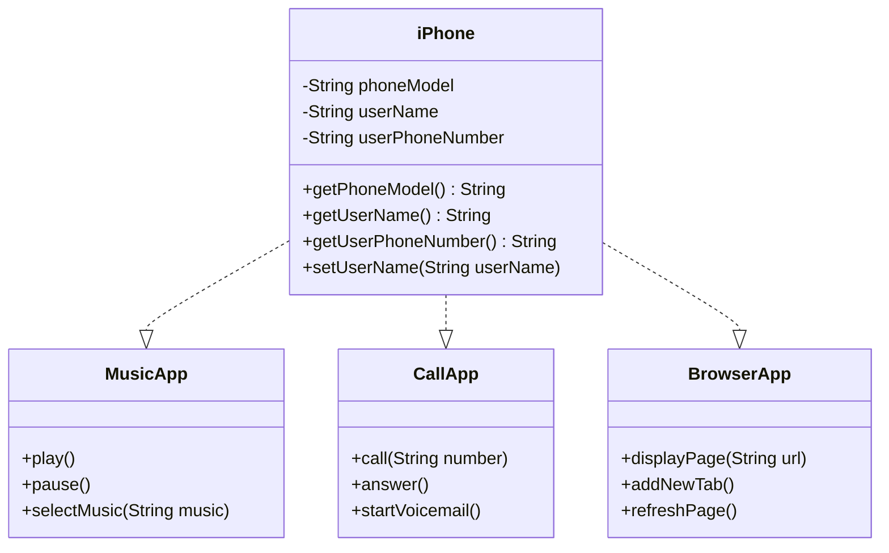

# Diagrama UML

```mermaid
classDiagram
        iPhone ..|> MusicApp
        iPhone ..|> CallApp
        iPhone ..|> BrowserApp
        iPhone : -String phoneModel
        iPhone : -String userName
        iPhone : -String userPhoneNumber
        iPhone : +getPhoneModel() String
        iPhone : +getUserName() String
        iPhone : +getUserPhoneNumber() String
        iPhone : +setUserName(String userName)

        class MusicApp {
          +play()
          +pause()
          +selectMusic(String music)
        }
        class CallApp {
          +call(String number)
          +answer()
          +startVoicemail()
        }
        class BrowserApp {
          +displayPage(String url)
          +addNewTab()
          +refreshPage()
        }
```