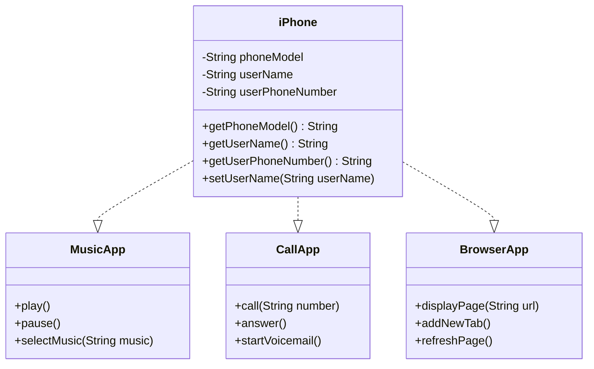

# 📱 Diagrama UML do iPhone

Este projeto faz parte do **Bootcamp Java Básico** oferecido pela [DIO - Digital Innovation One](https://www.dio.me).
O objetivo é modelar e representar em UML os principais componentes de um **iPhone**, simulando suas funcionalidades como **Reprodutor Musical**, **Aparelho Telefônico** e **Navegador de Internet**, inspirado no vídeo de lançamento original do iPhone em 2007.

## 🧠 Contexto

Inspirado pelo [lançamento do iPhone em 2007 por Steve Jobs](https://www.youtube.com/watch?v=9ou608QQRq8)
📌 Trecho relevante: de **00:15** até **00:55**

O iPhone foi apresentado como **três dispositivos em um**:

1. Um celular revolucionário
2. Um iPod com tela sensível ao toque
3. Um comunicador de internet inovador

Este projeto modela esse conceito usando **diagramas de classe UML** e **interfaces/classes Java**.

## ✅ Objetivos

* [x] Criar um diagrama UML usando a sintaxe do [Mermaid](https://mermaid.js.org/)
* [x] Representar o iPhone como uma composição de múltiplos componentes funcionais
* [ ] (Opcional) Implementar as classes e interfaces correspondentes em Java
---

## 📐 UML Class Diagram (Mermaid)

